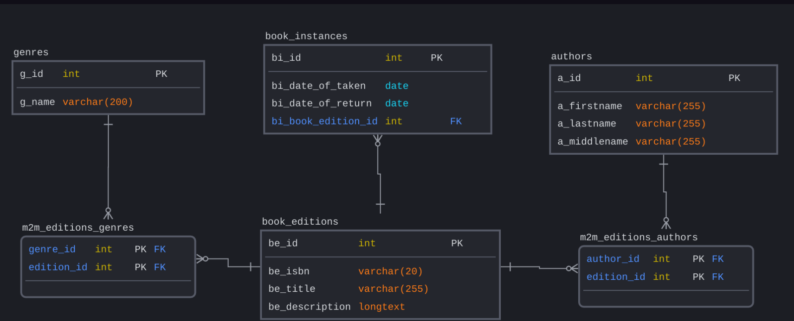

# Library API
A small CRUD Web Api for library simulation written using .Net Core with EF Core.

The Api has been created using N-layer architecture represented as follows:
- Api (Controller) layer
- Service layser
- DAO layer
- Infrastructure layer

## Prerequisites

Make sure you have the following software installed on your machine:

- Docker: [Install Docker](https://docs.docker.com/get-docker/)
- Docker Compose: [Install Docker Compose](https://docs.docker.com/compose/install/)
## Getting started

- Clone the repository: https://github.com/Albertbuh/LibraryApi
- Navigate to project directory:
```
	cd library
```
- Use docker compose to build neccessary images (mysql container for database + api container):
```
	docker-compose -f src/Library.API/docker-compose.yml build
```
- Use docker-compose to start project:
```
	docker-compose -f src/Library.API/docker-compose.yml up
```
-  Access the project:
	Once the containers are up and running, you can access the project by opening your web browser and navigating to *http://localhost:5000*


## Database overview 



It is assumed that book edition provided by library may have more than one copy (represented by *book_instances*), more than one genre and author.
> API has been created just for book manipulations, so it has no ability to add new genres or authors, you need to change LibraryContextSeed class for add new genres and authors or go directly to the database and add new data there. 
